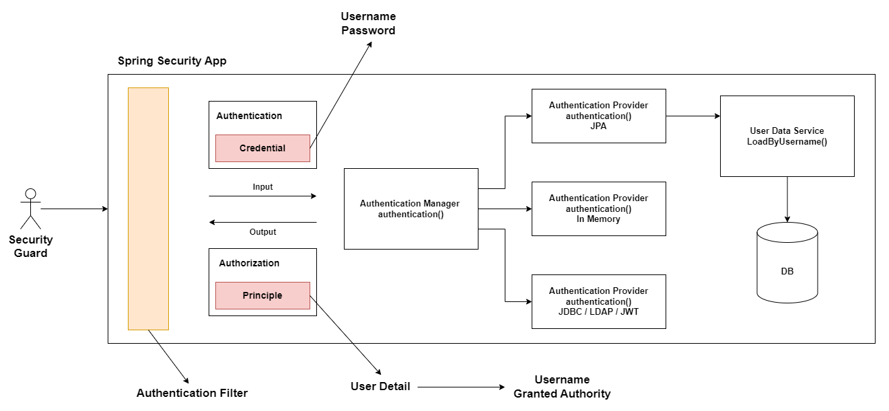

### Nama: Fuad Zein

### References:

- [mapstruct](https://mapstruct.org/documentation/installation/)
- [A guide to MapStruct with Spring Boot, Vavr & Lombok](https://medium.com/@tijl.b/a-guide-to-mapstruct-with-spring-boot-vavr-lombok-d5325b436220)
- [modelmapper](https://modelmapper.org/)
- [Spring Data JPA @Query](https://www.baeldung.com/spring-data-jpa-query)
- [JPA Query Methods](https://docs.spring.io/spring-data/jpa/reference/jpa/query-methods.html)
- [Repository query keywords](https://docs.spring.io/spring-data/jpa/reference/repositories/query-keywords-reference.html)
- [Guide to Spring Email](https://www.baeldung.com/spring-email)
- [One to One - Baeldung](https://www.baeldung.com/jpa-one-to-one)
- [Many to Many - Baeldung](https://www.baeldung.com/jpa-many-to-many)
- [Slide - Spring Security](https://docs.google.com/presentation/d/1b2ETIIyMlwXHQPS_5njzEyStkftRZvvm5o7wZTGP-vg/edit?usp=sharing)
- [Getting Spring Security](https://docs.spring.io/spring-security/reference/getting-spring-security.html)
- [Username/Password Authentication](https://docs.spring.io/spring-security/reference/servlet/authentication/passwords/index.html)
- [Spring Security Form Login](https://www.baeldung.com/spring-security-login)
- [Handling Passwords with Spring Boot and Spring Security](https://reflectoring.io/spring-security-password-handling/)
- [Base64](https://www.base64decode.org/)
- [Bcrypt Hash Generator](https://bcrypt-generator.com/)
- [Architecture Spring Security](https://docs.spring.io/spring-security/reference/servlet/architecture.html)
- [Spring Boot 3 + Spring Security 6 In Depth Understanding](https://medium.com/@aiagentofchange/spring-boot-3-spring-security-6-in-depth-understanding-927bb5e826ee)
- [Spring Security – Roles and Privileges](https://www.baeldung.com/role-and-privilege-for-spring-security-registration)
- [Spring Boot Security Auto-Configuration](https://www.baeldung.com/spring-boot-security-autoconfiguration)
- [How to Manually Authenticate User with Spring Security](https://www.baeldung.com/manually-set-user-authentication-spring-security)
- [Update the Spring Security configuration class with Spring Boot 2.7.0](https://github.com/spring-projects/spring-boot/issues/31239)
- [Update the Spring Security configuration class with Spring Boot 2.7.3](https://stackoverflow.com/questions/72427751/update-the-spring-security-configuration-class-with-spring-boot-2-7-3)
- [Document how to publish an AuthenticationManager @Bean without WebSecurityConfigurerAdapter](https://github.com/spring-projects/spring-security/issues/11926)

---

